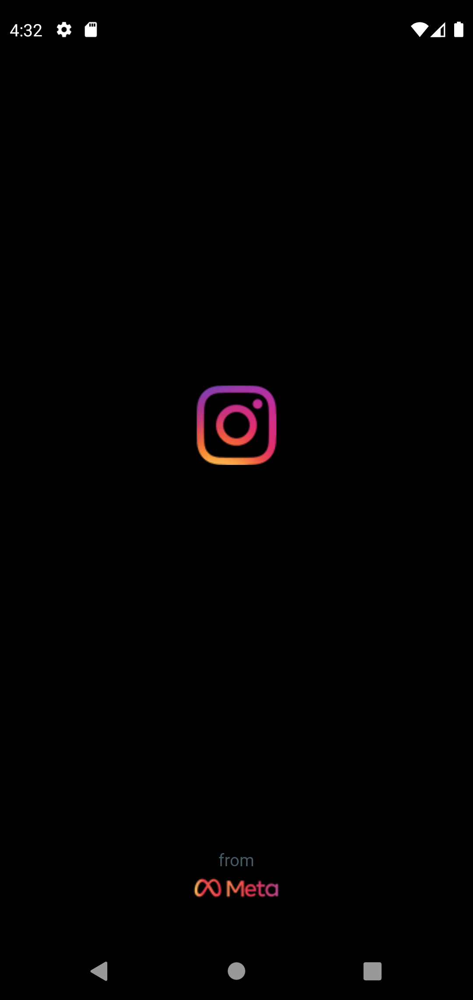
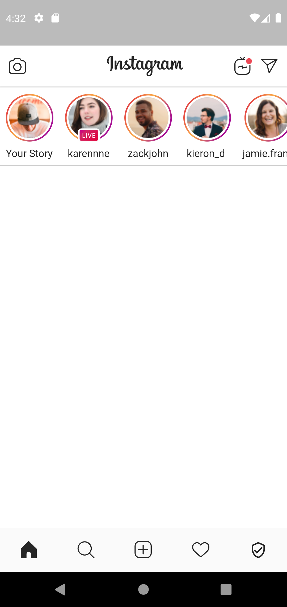
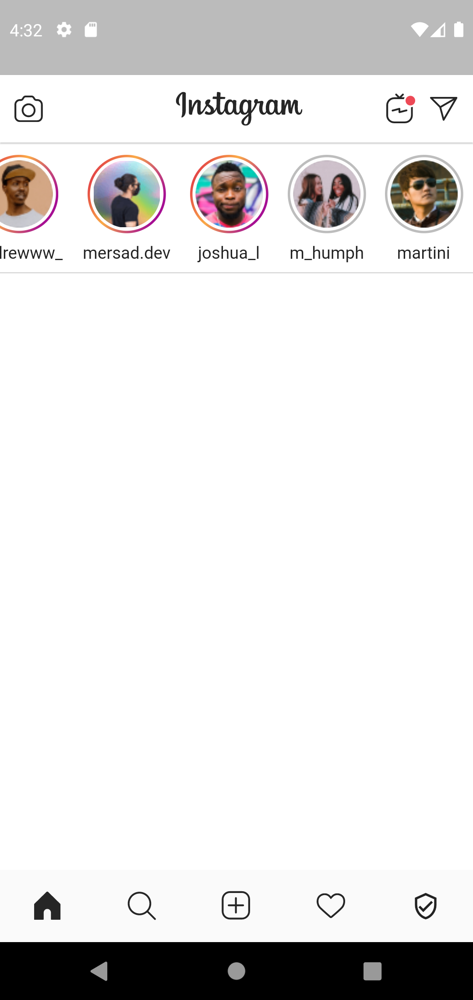

This is a Flutter app that replicates the user interface (UI) of the popular social media platform Instagram. It's a great starting point for anyone looking to learn Flutter or build their own Instagram-like app.

<<<<<<< HEAD
The app features a similar layout to the official Instagram app, with a bottom navigation bar that allows users to switch between views such as the home feed, search, notifications, and profile. It also includes various UI elements such as stories, posts, comments, and likes, which are all fully functional and can be customized to fit your needs.

=======
This is a Flutter app that replicates the user interface (UI) of the popular social media platform Instagram. It's a great starting point for anyone looking to learn Flutter or build their own Instagram-like app.

The app features a similar layout to the official Instagram app, with a bottom navigation bar that allows users to switch between views such as the home feed, search, notifications, and profile. It also includes various UI elements such as stories, posts, comments, and likes, which are all fully functional and can be customized to fit your needs.
>>>>>>> 782548e572b2c766b16d249f7c66add1f1965df9
